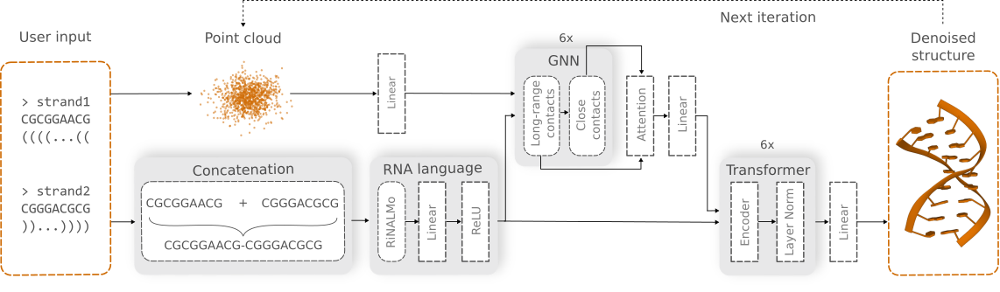

# Graph Neural Network and Diffusion Model for Modeling RNA Interatomic Interactions

Welcome to the official repository of GraphaRNA, a novel approach for RNA 3D structure prediction based on **graph neural networks (GNNs)** and **denoising diffusion models**. Unlike traditional methods that rely heavily on multiple sequence alignment (MSA) and structural templates, GraphaRNA utilizes **local RNA descriptors**, making it particularly effective in scenarios where the data is limited and highly imbalanced.

## Table of contents
* [Overview](#overview)
* [Model architecture](#model-architecture)
* [Installation](#installation)
* [Inference](#inference)
* [Training](#training)
* [Evaluation](#evaluation)
* [Citation](#citation)
* [License](#license)


## Overview
GraphaRNA leverages a graph-based approach combined with a denoising diffusion probabilistic model (DDPM) to predict the 3D structures of RNA at a fine-grained level. The core innovation of our model is the use of local RNA descriptors, which allows us to predict substructures of RNA rather than the full molecule at once. This tamplate-free approach was trained on rRNA and tRNA structures and generalizes to unseen RNA families. 

## Model architecture
GraphaRNA's architecture is based on GNNs combined with a diffusion model. Below is a visualization of the model architecture:


## Installation
Clone this repository and install the required dependencies using the following commands:
```
git clone git@github.com:mjustynaPhD/GraphaRNA.git
cd GraphaRNA
pip install .
```

Ensure you have **Python 3.10+** and **PyTorch 2.3.0+** installed, along with **PyTorch Geometric** for handling the graph components.

#### Install RiNALMo

RiNALMo is a key component of GraphaRNA. To install that follow the instruction:
```
git clone https://github.com/lbcb-sci/RiNALMo
cd RiNALMo
pip install .
pip install flash-attn==2.3.2

**Note**: To install flash-attn you need to run install it on GPU machine:
```

## Inference

#### Create your input.
Your input file should be in a ***.dotseq** format. The format looks as the example below:
```
>tsh_helix
CGCGGAACG CGGGACGCG
((((...(( ))...))))
```
First line is the name of the sequence, starting with `>`. Next line, is nucleotide sequence. Each strand is separated with white-space. The last line is a 2D structure in dot-bracket format. Similarly to sequence, each strand is separated by white-space. The following characters are allowed to mark interactions (including pseudoknots):
```
(), [], {}, <>, Aa, Bb, Cc, Dd
```

#### Prepare the file.
Run command:
```
python prepare_user_input.py --input-dir=user_inputs
```

The pickle files will be created in the directory `data/user_inputs`.

#### Run model
Then, to inference all structures from `data/user_inputs` directory run:
```
grapharna --seed=0 --batch_size=32 --dim=256 --n_layer=6 --timesteps=5000 --knns=20
```

## Training
If you wish to run training follow the instruction below.

#### Data preparation
First you need to preprocess your raw PDB/CIF files. For this purpose you need to run the following script:
```
python preprocess_rna_pdb.py --pdb_dir=<pdb_directory> --save_dir=data/<dataset name> --save_name=<train-pkl / test-pkl / val-pkl>
```

This script loads structures from PDB files and stores these files in pickle format. These files contain a molecule graph with all nodes and edges properties.

#### Run training
Once your data are preprocessed you are ready to run training. You can run it on a single GPU using the following command:
```
python main_rna_pdb_single.py --dataset <your dataset> --epoch=800 --batch_size=32 --dim=256 --n_layer=6 --lr=1e-3 --timesteps=5000 --mode=coarse-grain --knn=20 --wandb --lr-step=30
```
Or you can run it in a distributed system with the following bash script:
```
./run_distributed.sh
```
Note that the distributed script was created for a SLURM-based environement, so you will need to adapt it to your needs.

## Evaluation
In order to run evaluation you will need to run the following script:
```
python evaluate_predictions.py --preds-path=/home/<your path to GraphaRNA>samples/<experiment name>/<epoch>/, \
                "--targets-path=<path to pdb targets>", \
                --arena_path=<path to the arena>,
```

The key arguments:
* `preds-path` - path to models predictions. This is generated during training or when the user run an inference.
* `targets-path` - path to ground-truth PDBs. The structures predicted structures and targets will be aligned and the metrics will be computed (RMSD, eRMSD and INF).
* `arena_path` - path to the Arena. Arena is used to transform coarse-grained representation into full atom representation.

## Citation
## License
CC-BY 4.0
